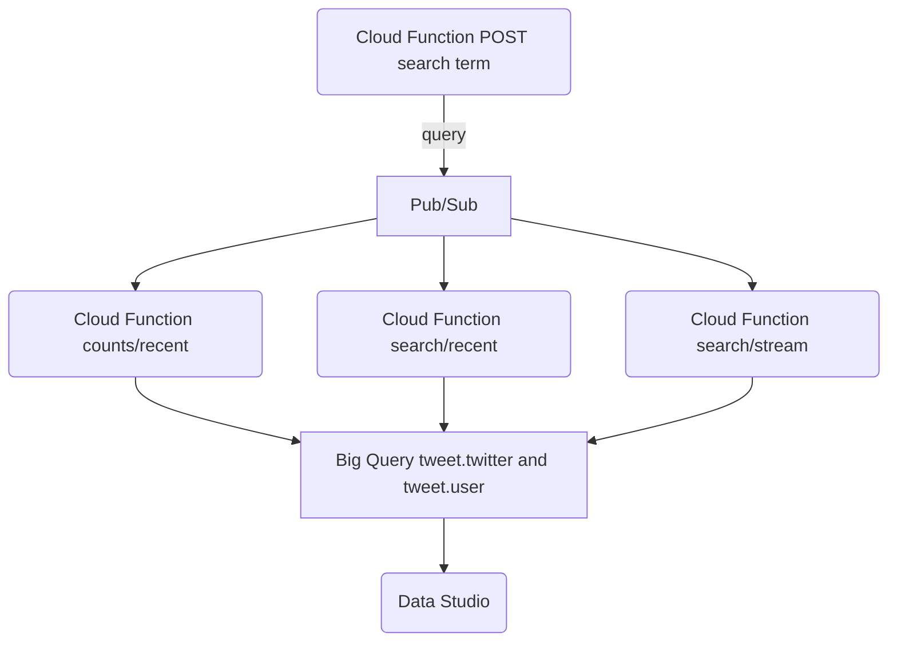

# Part 1

## Load data
Import [dummy user_changes data](part_1/bq_part1_user_changes.csv) to the database for example Big Query following instruction [here] (https://cloud.google.com/bigquery/docs/loading-data-cloud-storage-csv#loading_csv_data_into_a_table)

## Task 1.1
Objective: SQL query to find the user_id, current name and current email address for all users.

Solution: [query](part_1/find_latest.sql)
## Task 1.2
Objective: SQL query to find the median time between the second and third profile edit

Solution: [query](part_1/median_second_third_change.sql)

# Part 2
## To DO
1. add `pubsub` topic as `function` argument
1. check and compare count: directly via Twitter API vs these self developed functions
1. ETL with `airflow`
1. set cloud scheduler to trigger `function` every 5 seconds
1. set queueing and ACK in `pubsub` message/ eventarc
1. check Twitter API request limit for several endpoints used in the `functions`
1. check how to set up refresh rate in `Data Studio`
1. check memory limit in `Cloud Function`when importing `Text Classifier`from Flair as continuously getting error 
1. add lat updated datetime to the `Data Studio`report

## Problem
Create a proof-of-concept for a tool that allows the user to specify a search term and receive every five seconds an updated output of some metrics about tweets that contain the search term.
The specific insights the tool should provide in its output are:
1. What is the total count of tweets matching the search term seen so far?
1. How many tweets containing the search term were there in the last 1, 5 and 15 minutes?

**not-finished**
1. What are the ten most frequent terms (excluding the search term) that appear in tweets containing the search term over the last 1, 5 and 15 minutes?
1. Within tweets matching the search term, who were the top ten tweeps (Twitter users) who tweeted the most in the last 1, 5 and 15 minutes?
1. What is the sentiment of tweets matching the search term over the last 1, 5 and 15 minutes?

## Architecture Research
There are several ways to satisfy the requirement:
### 1. Virtual machine
1. Run code in WM streaming data to Pub/Sub. 
1. Create a pipeline in Dataflow to aggregate data and write to BigQuery. 
1. From BigQuery then create a dashboard using Data Studio.

[Forked reference](https://github.com/savvyt/twitter)
### 2. Local machine
1. Download tweets using Twitter API (https://developer.twitter.com/en/docs/twitter-api).
1. Send each tweet as a message to Google Pub/Sub.
1. Process the tweets using Apache Beam pipeline and aggregate the data.
1. Save both raw tweets and aggregated tweet data to BigQuery tables.

[Forked reference](https://github.com/savvyt/tweet-streaming) <br>
[Tutorial](https://dsstream.com/streaming-twitter-data-with-google-cloud-pub-sub-and-apache-beam)
### 3. App Engine

1. Add rules to the stream with the Filtered Stream rules API endpoint
1. Install and involve the toolkit from GitHub in your Google Cloud project
1. Configure the CRON job - Google Cloud Scheduler
1. Configure the dashboard, by connecting to the BigQuery database with DataStudio

[Reference: developer-guide--twitter-api-toolkit-for-google-cloud](https://developer.twitter.com/en/docs/tutorials/developer-guide--twitter-api-toolkit-for-google-cloud1)
### 4. Cloud Functions
[Reference: serverless-twitter-bot-with-google-cloud](https://itnext.io/serverless-twitter-bot-with-google-cloud-35d370676f7) <br>
[Reference: cloud-function-to-publish-messages-to-pub-sub](https://medium.com/@chandrapal/creating-a-cloud-function-to-publish-messages-to-pub-sub-154c2f472ca3)

### Comparison:
||VM   | Local machine  |  App Engine |   Cloud Function|
|---|---|---|---|---|
|Connection|can be 24/7 except during maintenance window | Not always connected  |Can get disconnected and must restart the process by establishing a new connection. Additionally, to ensure that you do not miss any data, you may need to utilize a Redundant Connection, Backfill, or a Replay stream to mitigate or recover data from disconnections from the stream.|Streaming is problematic because you have to be always connected. And with serverless product you have timeout concern (9 minutes for Cloud Functions V1, 60 minutes for Cloud Run and Cloud Functions V2). However you can imagine to invoke regularly your serverless product, stay connected for a while (let say 1h) and schedule trigger every hour.|

## Prereqs
You'll need: 1) Twitter Developer credentials and 2) a GCP account set up.

Once you have a Twitter Developer account, you'll need an app, API consumer key (and secret), access token (and secret), and bearer token.

(You may need to enable to the relevant APIs on your GCP account - Compute Engine, GCS, Dataflow, and BigQuery. You can do that using the search bar at the top of the GCP interface.)

## Solution


### 1. Create [Cloud Function Keyword](part_2/function-keyword)
User is expected to input HTTPS Post to the function. Example from Google Cloud Shell:
```
curl -m 70 -X POST https://pubsub-test-keyword-nibljnhwbq-lz.a.run.app \
-H "Authorization: bearer $(gcloud auth print-identity-token)" \
-H "Content-Type: application/json" \
-d '{
  "name": "trondheim"
}'
````
### 2. Create Pub/Sub topic. 
Create a `Pub/Sub` topic and name it accordingly (something like `twitter` will work). Function `Cloud Function Keyword` will publish a message to the topic. From the GUI, then press the Trigger Cloud Function button. It will create a new Function where you could then modify and insert your [Function Count Recent](part_2/function-count-recent). Create another trigger and insert your [Function Search Recent](part_2/function-search-recent) to the newly created Function.

Under the hood: <br>
Google will automatically push the message from your topic into an automatically created Subscription. Then a 'Cloud Run' will push your message from the 'Subscription' to the `Function Count Recent`.

At the console, go to [Eventarc](https://console.cloud.google.com/eventarc/) and you could 
### 3. Create BigQuery dataset and table
[Function search recent](part_2/function-search-recent/main.py) will write your tweets and users in the past 15 minutes to BigQuery, so it would be necessary to create the dataset and tables beforehand. Update the [main.py](part_2/function-search-recent/main.py) if you decided to give different name to your tables.
### 4. Deploy [Tweet Streaming](../02.%20Twitter/tweet-streaming) to stream the tweet data

## Flow
1. ### dfgd
1. ### fdgdf
### TO DO
1. Fix timeout with Cloud Function.
1. Apply Airflow or Dataflow to automate and better tracking the ETL job.
1. create new branch and apply proper CI/CD. Not done in this POC because of time limitation.

### Challenges
1. Unable to use Workflow to input variable to another cloud function due to error 500 link
<br>These intermittent 500s are due to requests timing out in the pending queue while waiting for a clone to be able to service the request. This is quite common for GCF apps when they attempt to scale up extremely rapidly. The best approach would be to configure your workload so that they don't have such sharp spikes from ~0 QPS - e.g. if you ramp up traffic gradually over the course of a minute they'll be far less likely to see these errors.
